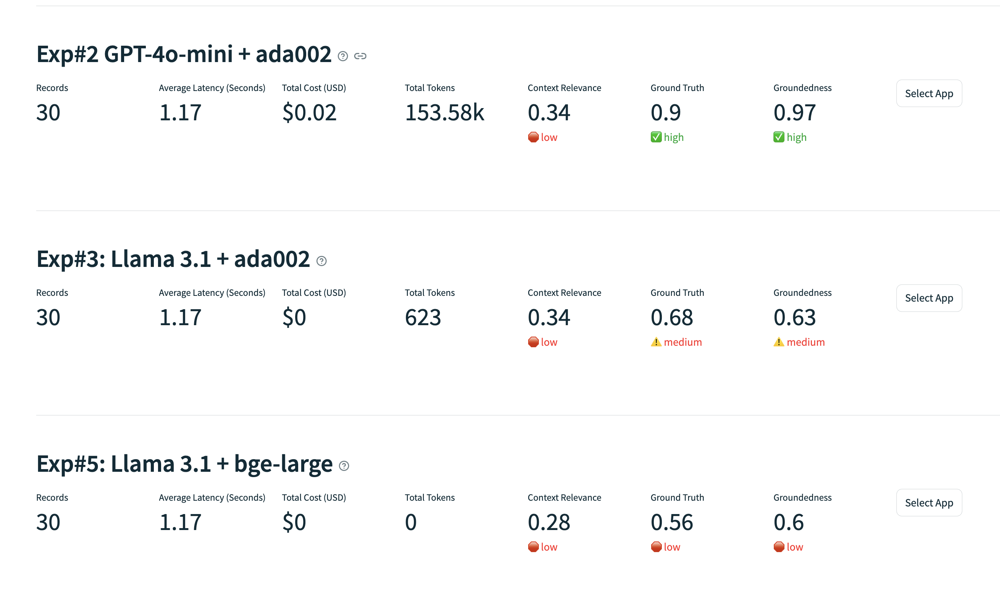
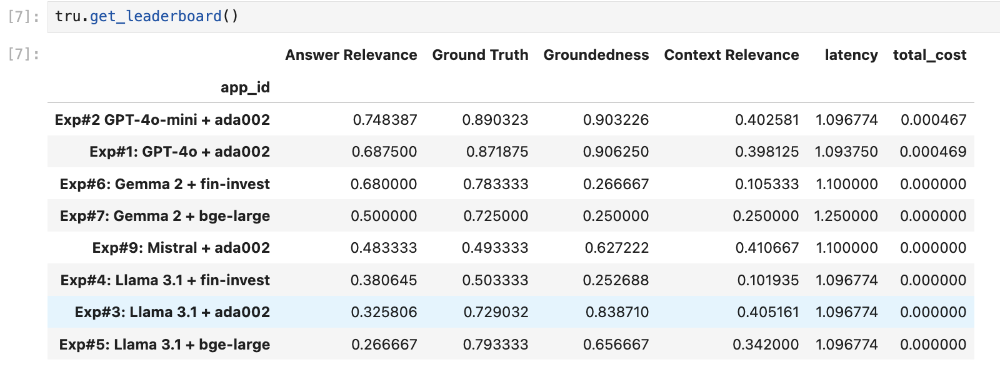
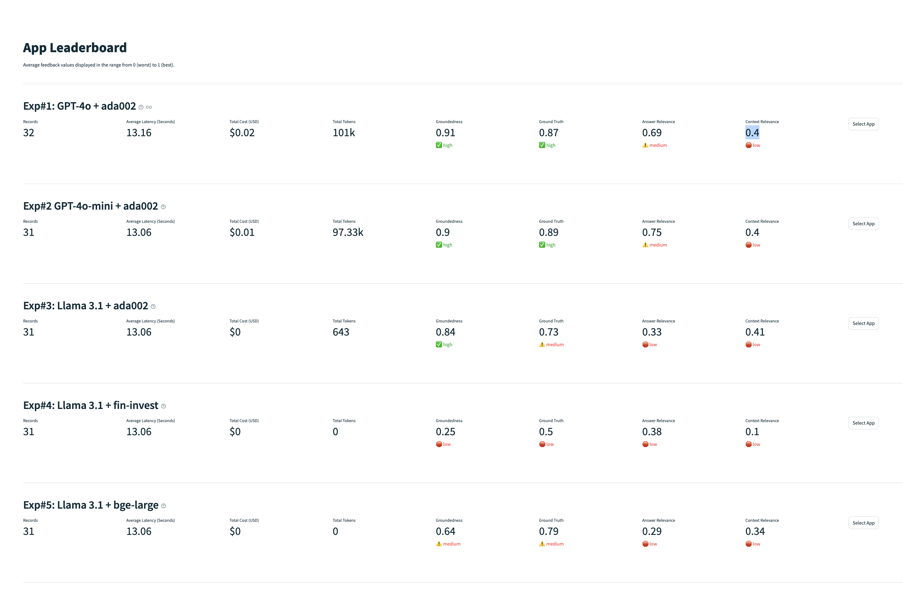
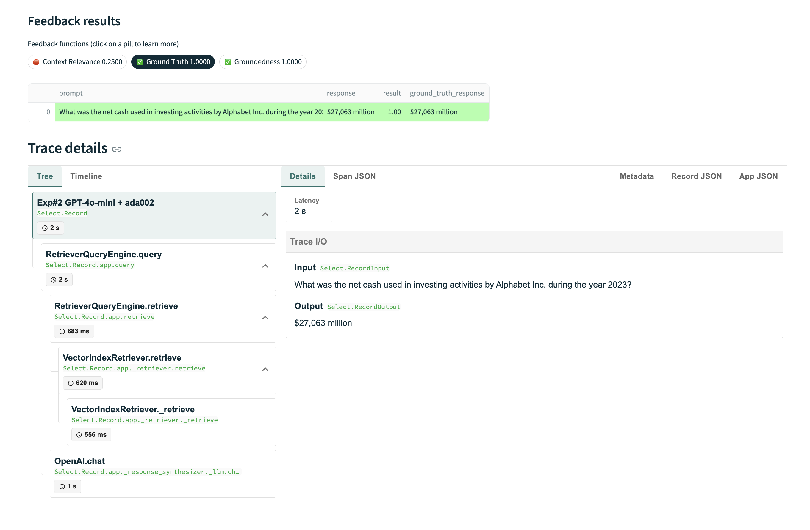
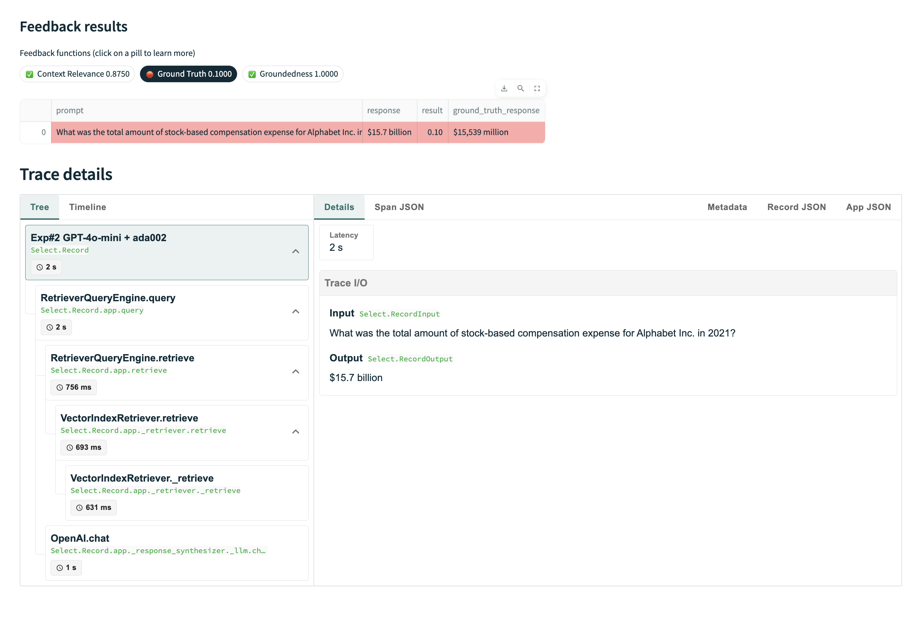
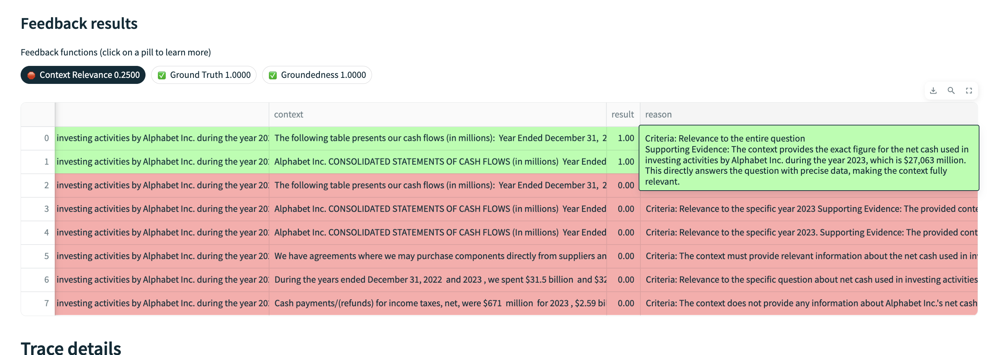
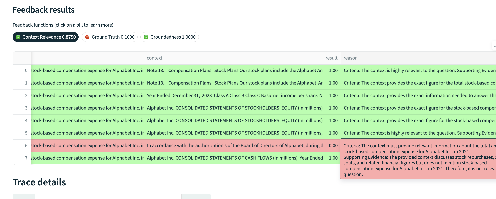
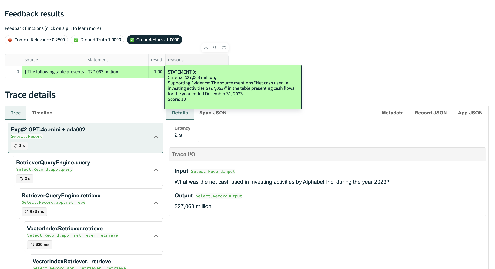
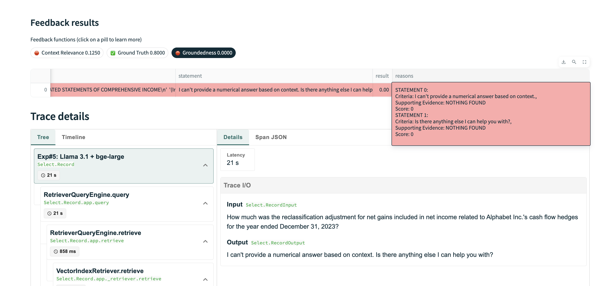

## RAG Them All!

## Overview

This project is dedicated to running various experiments using different Language Models (LLMs) and embedding models for financial question-answering tasks. The key objectives include loading financial data, configuring and running experiments with various model combinations, and evaluating their performance using several metrics.

## Contents

### Imports

The notebook starts with importing necessary libraries and modules required for data manipulation, model loading, vector storage, and evaluation. Configurations for API tokens and other settings are set up to ensure proper access to necessary services.

### Loading Test Data

Financial QA dataset is loaded, filtered, and prepared for the experiments. The dataset consists of questions and answers related to financial reports, specifically focusing on Alphabet Inc. for the year 2023.

### Experimentation Config

Various configurations for the experiments are defined here. Different combinations of LLMs and embedding models are set up to be tested.

### Experiment Runs

Experiments are executed with the defined configurations. Each experiment involves loading the appropriate index, configuring the retriever and response synthesizer, and running the query engine. The results are collected and recorded for further evaluation.

### Leaderboard & Dashboard

The results of the experiments are compiled into a leaderboard, showcasing the performance of each model combination based on metrics such as context relevance, groundedness, ground truth agreement, latency, and cost. A dashboard is started to provide a visual interface for exploring the results of the experiments

## Screenshots

### Experimenting with Models

**Experimenting with GPT-4o and Llama 3.1B :**
Experimenting with the capabilities and performance of GPT-4o and Llama 3 models.

**Mega experiment running many combinations of open-source and closed-source models plus embeddings:**
A comprehensive experiment involving numerous combinations of both open-source and proprietary models along with embeddings.

**Dashboard view of the mega experiment results:**
A dashboard summarizing the results of the extensive experiment involving multiple model combinations.

### Ground Truth Examples

**Ground truth positive example:**
An example demonstrating a positive ground truth scenario.

**Ground truth negative example:**
An example demonstrating a negative ground truth scenario.

### Context Relevance from RAG

**Context relevance from RAG positive example:**
An example highlighting positive context relevance in a Retrieval-Augmented Generation (RAG) setup.

**Context relevance from RAG negative example:**
An example highlighting negative context relevance in a Retrieval-Augmented Generation (RAG) setup.

### Groundedness Examples

**Groundedness positive example:**
An example illustrating positive groundedness in a model's response.

**Groundedness negative example:**
An example illustrating negative groundedness in a model's response.